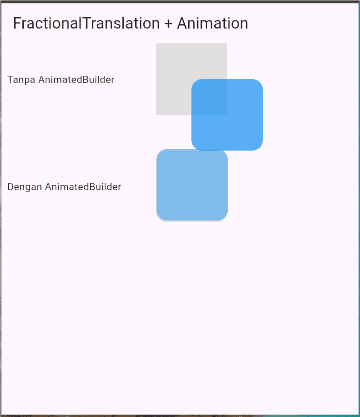

**📦 Apa itu FractionalTranslation?**
`FractionalTranslation` adalah widget Flutter yang menggeser (mentranslasikan) posisi child-nya berdasarkan nilai `Offset` relatif terhadap ukuran child-nya sendiri.

➡️ *Ini berbeda dengan Transform.translate, yang bekerja berdasarkan nilai piksel mutlak (`Offset(dx, dy)` dalam unit layar).*

- **🔧 Sintaks Dasar**
    ```dart
    FractionalTranslation({
        Key? key,
        required Offset translation,
        bool transformHitTests = true,
        required Widget child,
    })
    ```
- 🧮 **Cara Kerja Properti translation**
    Properti translation bertipe `Offset(dx, dy)` di mana:

    - `dx` adalah perpindahan horizontal relatif terhadap lebar child

    - `dy` adalah perpindahan vertikal relatif terhadap tinggi child

    Misalnya:

    - `Offset(1.0, 0.0)` → geser sejauh 1 lebar child ke kanan

    - `Offset(0.0, 1.0)` → geser sejauh 1 tinggi child ke bawah

    - `Offset(-0.5, -0.5)` → geser setengah ukuran child ke kiri dan atas

- 📌 **Contoh Sederhana**
    ```dart
    Center(
        child: Container(
            color: Colors.grey[300],
            width: 200,
            height: 200,
            child: FractionalTranslation(
            translation: Offset(0.5, 0.5),
            child: Container(
                width: 50,
                height: 50,
                color: Colors.blue,
                ),
            ),
        ),
    )
    ```
    Penjelasan:
    - Kotak biru awalnya berada di pojok kiri atas container abu-abu.

    - Dengan Offset(0.5, 0.5), kotak biru tergeser ke kanan dan ke bawah sebesar setengah ukurannya sendiri.

- 🎯 **Kapan Digunakan?**
    - Untuk efek animasi halus berbasis ukuran (relatif, bukan piksel).

    - Membuat transisi posisi yang responsif terhadap ukuran widget.

    - Dipadukan dengan AnimatedBuilder atau Tween<Offset>.

- ⚠️ transformHitTests
    - true (default): posisi baru (yang sudah digeser) akan menerima interaksi/klik.

    - false: klik masih terdeteksi di posisi awal sebelum digeser.



**Kode Lengkap**
```dart
import 'package:flutter/material.dart';

class FractionalTranslationExample extends StatefulWidget {
  const FractionalTranslationExample({super.key});

  @override
  State<FractionalTranslationExample> createState() =>
      _FractionalTranslationExampleState();
}

class _FractionalTranslationExampleState
    extends State<FractionalTranslationExample>
    with SingleTickerProviderStateMixin {
  late AnimationController _controller;
  late Animation<Offset> _offsetAnimation;

  @override
  void initState() {
    super.initState();

    // Inisialisasi controller
    _controller = AnimationController(
      vsync: this,
      duration: const Duration(seconds: 2),
    )..repeat(reverse: true);

    // Tween animasi Offset relatif
    _offsetAnimation = Tween<Offset>(
      begin: Offset.zero,
      end: const Offset(0.5, -1), // geser 50% dari ukuran widget
    ).animate(CurvedAnimation(parent: _controller, curve: Curves.easeInOut));
  }

  @override
  void dispose() {
    _controller.dispose(); // penting untuk menghindari memory leak
    super.dispose();
  }

  @override
  Widget build(BuildContext context) {
    return Scaffold(
      appBar: AppBar(title: const Text("FractionalTranslation + Animation")),
      body: Column(
        children: [
          Row(
            children: [
              const Padding(
                padding: EdgeInsets.all(8.0),
                child:
                    SizedBox(width: 200, child: Text('Tanpa AnimatedBuilder')),
              ),
              Center(
                child: Center(
                  child: Container(
                    color: Colors.grey[300],
                    width: 100,
                    height: 100,
                    child: FractionalTranslation(
                      translation: Offset(0.5, 0.5),
                      child: Container(
                        // ukuran widget child tidak berpengaruh
                        // artinya tidak perlu membuat ukuran child
                        // karena ukurannya tetap menyesuaikan
                        // ke ukuran iduknya yaitu 100 X 100
                        width: 50,
                        height: 50,
                        decoration: BoxDecoration(
                          color: Colors.blue.withOpacity(0.75),
                          borderRadius: BorderRadius.circular(15.0),
                        ),
                      ),
                    ),
                  ),
                ),
              ),
            ],
          ),
          const SizedBox(height: 50),
          Row(
            children: [
              const Padding(
                padding: EdgeInsets.all(8.0),
                child: SizedBox(
                  width: 200,
                  child: Text('Dengan AnimatedBuilder'),
                ),
              ),
              Center(
                child: Container(
                  width: 100,
                  height: 100,
                  decoration: BoxDecoration(
                    color: Colors.grey.shade300,
                    borderRadius: BorderRadius.circular(15.0),
                  ),
                  child: AnimatedBuilder(
                    animation: _offsetAnimation,
                    builder: (context, child) {
                      return FractionalTranslation(
                        translation: _offsetAnimation.value,
                        child: child,
                      );
                    },
                    child: Container(
                      // width: 50,
                      // height: 50,
                      decoration: BoxDecoration(
                        color: Colors.blue.withOpacity(0.5),
                        borderRadius: BorderRadius.circular(15.0),
                      ),
                    ),
                  ),
                ),
              ),
            ],
          ),
        ],
      ),
    );
  }
}

```