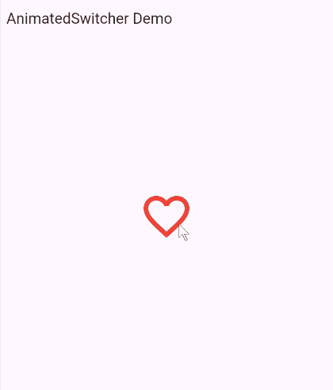
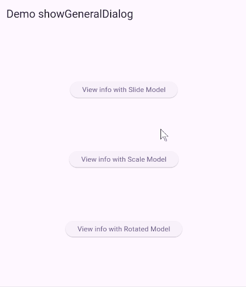

#### Widget Flutter yang menggunakan `transitionBuilder` sebagai parameter property

Di Flutter, `transitionBuilder` adalah properti yang memungkinkan kita mengendalikan animasi transisi atau perubahan tampilan antar keadaan. Beberapa widget menyediakan properti ini agar kita bisa menentukan sendiri animasinya. Berikut adalah widget-widget yang memiliki `transitionBuilder` sebagai properti: 

1. **AnimatedSwitcher**
    - 🔄 **Apa Itu `AnimatedSwitcher`?**
        `AnimatedSwitcher` adalah widget Flutter yang secara otomatis menganimasikan pergantian widget anaknya (child) saat child tersebut berubah. Perubahan ini terdeteksi dari perbedaan key antar child.

        *Tujuan:*
        *Mempermudah animasi transisi antar widget tanpa harus membuat animasi manual.*

        ---

    - 🧠 **Cara Kerja**
        Setiap kali widget child dari `AnimatedSwitcher` berubah (karena `setState` atau lainnya) dengan `key` berbeda, maka:

        - `AnimatedSwitcher` menganimasikan child lama keluar (`outgoing transition`).

        - Kemudian menganimasikan child baru masuk (`incoming transition`).

        ---

    - ✅ **Syarat Wajib:**
        Agar transisi bisa terjadi:

        - Child lama dan baru harus memiliki `key` yang berbeda (`ValueKey`, `UniqueKey`, dll).

        Tanpa `key`, `AnimatedSwitcher` akan menganggap child-nya belum berubah.

        ---
        `animatedswitcher_sampel.dart`
        

    - 🧪 **Contoh Dasar:**
        ```dart
        import 'package:flutter/material.dart';

        class AnimatedSwitcherDemo extends StatefulWidget {
        const AnimatedSwitcherDemo({super.key});

        @override
        State<AnimatedSwitcherDemo> createState() => _AnimatedSwitcherDemoState();
        }

        class _AnimatedSwitcherDemoState extends State<AnimatedSwitcherDemo> {
        bool isFavorite = false;

        @override
        Widget build(BuildContext context) {
            return Scaffold(
            appBar: AppBar(title: const Text('AnimatedSwitcher Demo')),
            body: Center(
                child: GestureDetector(
                onTap: () {
                    setState(() {
                    isFavorite = !isFavorite;
                    });
                },
                child: AnimatedSwitcher(
                    duration: const Duration(milliseconds: 300),
                    transitionBuilder: (child, animation) =>
                        ScaleTransition(scale: animation, child: child),
                    child: Icon(
                    isFavorite ? Icons.favorite : Icons.favorite_border,
                    key: ValueKey<bool>(isFavorite),
                    color: Colors.red,
                    size: 80,
                    ),
                ),
                ),
            ),
            );
        }
        }

        ```

        **Contoh lain** 
        Beralih dari ListView.builder ke GridView.builder
        ```dart 
        import 'package:flutter/material.dart';

        class ToggleListGridDemo extends StatefulWidget {
        const ToggleListGridDemo({super.key});

        @override
        State<ToggleListGridDemo> createState() => _ToggleListGridDemoState();
        }

        class _ToggleListGridDemoState extends State<ToggleListGridDemo> {
        bool isGrid = false;

        final List<String> items = List.generate(20, (index) => 'Item ${index + 1}');

        @override
        Widget build(BuildContext context) {
            return Scaffold(
            appBar: AppBar(
                title: const Text('ListView ⇄ GridView'),
                actions: [
                    IconButton(
                        icon: Icon(isGrid ? Icons.list : Icons.grid_view),
                        onPressed: () {
                            setState(() {
                                isGrid = !isGrid;
                            });
                        },
                    )
                ],
            ),
            body: AnimatedSwitcher(
                    duration: const Duration(milliseconds: 400),
                    switchInCurve: Curves.easeIn,
                    switchOutCurve: Curves.easeOut,
                    transitionBuilder: (child, animation) {
                    final offsetAnimation = Tween<Offset>(
                        begin: const Offset(0.0, 1.0), // dari bawah ke atas
                        end: Offset.zero,
                    ).animate(animation);

                    return SlideTransition(
                        position: offsetAnimation,
                        child: FadeTransition(
                            opacity: animation,
                            child: child,
                        ),
                    );
                },
                child: isGrid
                    ? GridView.builder(
                        key: const ValueKey('grid'),
                        padding: const EdgeInsets.all(10),
                        gridDelegate: const SliverGridDelegateWithFixedCrossAxisCount(
                            crossAxisCount: 2,
                            crossAxisSpacing: 10,
                            mainAxisSpacing: 10,
                            childAspectRatio: 5 / 2,
                            ),
                        itemCount: items.length,
                        itemBuilder: (context, index) {
                            return GridTile(
                                child: Container(
                                decoration: BoxDecoration(
                                    color: Colors.teal[100],
                                    borderRadius: BorderRadius.circular(18)),
                                alignment: Alignment.center,
                                child: Text(items[index]),
                                ),
                            );
                        },
                    )
                    : ListView.builder(
                        key: const ValueKey('list'),
                        itemCount: items.length,
                        padding: const EdgeInsets.symmetric(vertical: 10),
                        itemBuilder: (context, index) {
                            return Card(
                                child: ListTile(
                                    leading: const Icon(Icons.label),
                                    title: Text(items[index]),
                                    tileColor: index.isEven ? Colors.grey[200] : null,
                                ),
                            );
                        },
                    ),
            ),
            );
        }
        }


        ```

        ---

    - 🔧 **Properti Penting**
        |Properti	|Keterangan|
        |:----------|:---------|
        `child`	|Widget yang akan dianimasikan perubahannya.
        `duration`	|Durasi transisi masuk & keluar.
        `transitionBuilder`	|Fungsi untuk menentukan jenis animasi yang digunakan, misalnya `FadeTransition`, `ScaleTransition`, `SlideTransition`, dll.
        `layoutBuilder`	|Mengatur bagaimana child lama dan baru ditumpuk. Default: Stack.
        `switchInCurve` / `switchOutCurve`	|Mengatur kurva animasi masuk/keluar.

        ---

    - 🎨 **Contoh transitionBuilder:**
        ```dart
        transitionBuilder: (Widget child, Animation<double> animation) {
            return FadeTransition(
                opacity: animation,
                child: child,
            );
        }
        ```
        Atau:

        ```dart
        transitionBuilder: (child, animation) =>
            SlideTransition(
                position: Tween<Offset>(
                    begin: const Offset(1.0, 0.0),
                    end: Offset.zero,
                ).animate(animation),
                child: child,
            ),
        ```

        ---
    - 📌 **Kapan Menggunakan AnimatedSwitcher?**
        - Tombol toggle (icon berubah).

        - Widget berubah isi (angka berubah, ikon berubah).

        - Respons interaksi pengguna yang mengganti tampilan dengan efek visual yang halus.

        ---

    - ⚠️ **Catatan:**
        - Jangan lupa menggunakan `Key` (biasanya `ValueKey`) untuk setiap child agar animasi bisa bekerja.

        - Gunakan `AnimatedSwitcher` untuk transisi antar widget, bukan animasi properti dalam satu widget (untuk itu pakai `AnimatedContainer`, `TweenAnimationBuilder`, dll).

---

2. 📦 **Apa itu `showGeneralDialog`?**

    `showGeneralDialog` adalah fungsi paling fleksibel untuk membuat dialog kustom di Flutter. Berbeda dari `showDialog`, fungsi ini memberi kontrol penuh terhadap tampilan, animasi transisi, posisi, dan latar belakang dialog.

        ⚠️  showGeneralDialog tidak memiliki UI default — 
            kita harus mendesain isi dialog sendiri sepenuhnya.
        
    ---

    - 🧪 **Struktur Dasar**
        ```dart
    
        showGeneralDialog(
            context: context,
            barrierDismissible: true,
            barrierLabel: 'Dismiss',
            barrierColor: Colors.black.withOpacity(0.5),
            transitionDuration: Duration(milliseconds: 300),
            pageBuilder: (context, animation, secondaryAnimation) {
                return Center(
                    child: Material(
                        child: Container(
                            padding: EdgeInsets.all(20),
                            color: Colors.white,
                            child: Text("Dialog Custom"),
                            ),
                        ),
                );
            },
            transitionBuilder: (context, animation, secondaryAnimation, child) {
                return ScaleTransition(
                    scale: animation,
                    child: child,
                );
            },
        );
        ```
    ---
    - 📌 **Parameter Penting**
        |Properti	|Tipe	|Keterangan|
        |:----------|:------|:---------|
        `context`	|`BuildContext`	|Diperlukan untuk menampilkan dialog.
        `pageBuilder`	|`Widget Function(BuildContext, Animation<double>, Animation<double>)`	|Fungsi untuk membangun isi dialog.
        `transitionBuilder`	|`Widget Function(...)`	|Fungsi opsional untuk menentukan animasi transisi.
        `transitionDuration`	|`Duration`	|Waktu transisi animasi masuk dan keluar.
        `barrierDismissible`	|`bool`	|Apakah klik di luar dialog menutupnya?
        `barrierColor`	|`Color`	|Warna overlay latar belakang.
        `barrierLabel`	|`String?`	|Label untuk pembaca layar (aksesibilitas).
        `useRootNavigator`	|`bool`	|Gunakan navigator utama atau bukan.
        `routeSettings`	|`RouteSettings?`	|Untuk menyetel nama rute, jika diperlukan.|
    ---

    - 🧠 **Pemahaman transitionBuilder**
        Digunakan untuk memberikan efek transisi masuk dan keluar dialog. Misalnya:

        ✅ Contoh: Fade
        ```dart
        transitionBuilder: (context, animation, secondaryAnimation, child) {
            return FadeTransition(
                opacity: animation,
                child: child,
            );
        }
        ```
        ✅ Contoh: Scale
        ```dart
        ScaleTransition(
            scale: animation,
            child: child,
        );
        ```
        ✅ Contoh: Rotation
        ```dart
        RotationTransition(
            turns: animation,
            child: child,
        );
        ```
        kita juga bisa menggunakan kombinasi beberapa animasi dengan `AnimatedBuilder` atau `AnimatedWidget`.
    ---

    - 🎯 **Kapan Gunakan `showGeneralDialog`?**
        Gunakan ini saat kita ingin:

        - Mengontrol posisi, ukuran, dan gaya dialog sepenuhnya.

        - Menambahkan transisi khusus (rotasi, slide dari pojok, fade, dsb).

        - Membuat dialog non-standar seperti pop-up transparan, custom sheet, atau modal animasi unik.
    ---

    - ⚠️ **Tips dan Catatan**
        - Selalu bungkus konten dengan `Material` atau `Cupertino` agar tampilan dan gestur bekerja normal.

        - Jangan lupa barrierColor agar latar belakang redup atau buram sesuai desain.

        - Karena ini adalah fungsi kustom, tidak ada tombol `OK/Cancel` default — kita harus membuat sendiri.
    ---
    **`show_generaldialog_sampel.dart`**

    
    - 💡 **Contoh Penggunaan Realistis**
        ```dart
        import 'dart:ui';

        import 'package:flutter/material.dart';

        class GeneralDialogDemo extends StatefulWidget {
        const GeneralDialogDemo({super.key});

        @override
        State<GeneralDialogDemo> createState() => _GeneralDialogDemoState();
        }

        class _GeneralDialogDemoState extends State<GeneralDialogDemo> {

        
            void _infoScaleModel(BuildContext context) {
                showGeneralDialog(
                context: context,
                barrierDismissible: true,
                barrierLabel: MaterialLocalizations.of(context).modalBarrierDismissLabel,
                barrierColor: const Color(0xff1d2630).withOpacity(0.5),
                //.withOpacity(0.5), // Background semi-transparan
                transitionDuration: const Duration(milliseconds: 500), // Durasi animasi
                pageBuilder: (context, animation1, animation2) {
                    return Align(
                    alignment: Alignment.center,
                    child: Material(
                        color: Colors.transparent,
                        child: ClipRRect(
                        borderRadius: const BorderRadius.all(Radius.circular(20)),
                        child: BackdropFilter(
                            filter: ImageFilter.blur(sigmaX: 10.0, sigmaY: 10.0),
                            child: Container(
                            width: MediaQuery.of(context).size.width * 0.75,
                            height: MediaQuery.of(context).size.height * 0.34,
                            padding: const EdgeInsets.all(20),
                            decoration: BoxDecoration(
                                color: Colors.teal.withOpacity(0.4),
                                borderRadius: BorderRadius.circular(15),
                            ),
                            child: Column(
                                mainAxisSize: MainAxisSize.min,
                                children: [
                                const Text(
                                    'Konfirmasi',
                                    style: TextStyle(
                                        fontSize: 22, fontWeight: FontWeight.bold),
                                ),
                                const SizedBox(height: 10),
                                const Text(
                                    'Apakah Anda yakin ingin melanjutkan aksi ini?',
                                    textAlign: TextAlign.center,
                                ),
                                const Spacer(),
                                Row(
                                    mainAxisAlignment: MainAxisAlignment.spaceEvenly,
                                    children: [
                                        ElevatedButton.icon(
                                            onPressed: () => Navigator.pop(context),
                                            icon: const Icon(Icons.close),
                                            label: const Text('Batal'),
                                            style: ElevatedButton.styleFrom(
                                                backgroundColor: Colors.grey,
                                                foregroundColor: Colors.black),
                                        ),
                                        ElevatedButton.icon(
                                            onPressed: () {
                                                Navigator.pop(context);
                                                ScaffoldMessenger.of(context).showSnackBar(
                                                    const SnackBar(
                                                            content: Text('Aksi dikonfirmasi!')),
                                                );
                                            },
                                            icon: const Icon(Icons.check),
                                            label: const Text('Lanjut'),
                                            style: ElevatedButton.styleFrom(
                                                backgroundColor: Colors.teal.shade800,
                                                foregroundColor: Colors.white,
                                            ),
                                        ),
                                    ],
                                )
                                ],
                            ),
                            ),
                        ),
                        ),
                    ),
                    );
                },

               
                transitionBuilder: (context, animation, secondaryAnimation, child) {
                    return ScaleTransition(
                        scale: CurvedAnimation(
                            parent: animation,
                            curve: Curves.easeOutBack, // Efek zoom dengan pantulan lembut
                        ),
                        child: child,
                    );
                },

            }


            @override
            Widget build(BuildContext context) {
                return Scaffold(
                    appBar: AppBar(title: const Text('Demo showGeneralDialog')),
                    body: Center(
                        child: Column(
                            mainAxisAlignment: MainAxisAlignment.spaceEvenly,
                            children: [
                                ElevatedButton(
                                    onPressed: () => _infoScaleModel(context),
                                    child: const Text('View info with Scale Model'),
                                ),
                    
                            ],
                        ),
                    ),
                );
            }
        }


        ```